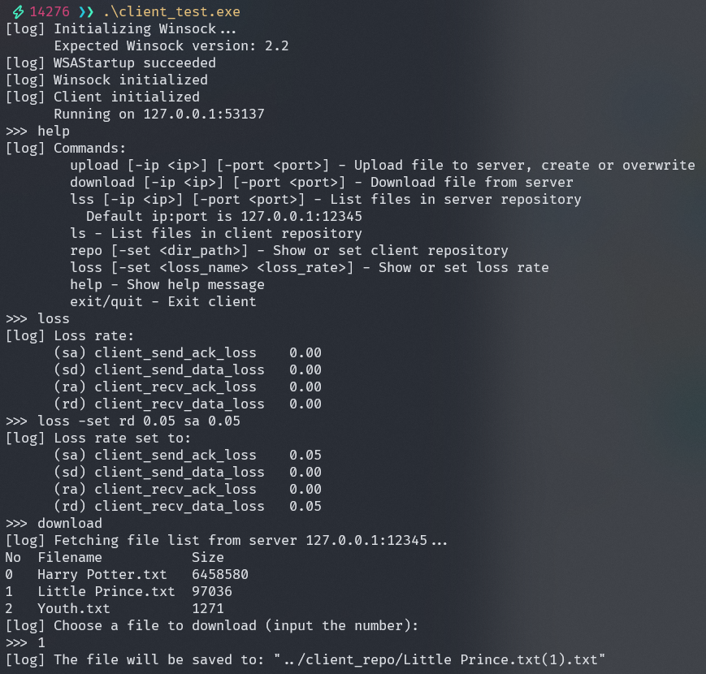
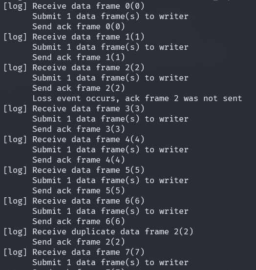
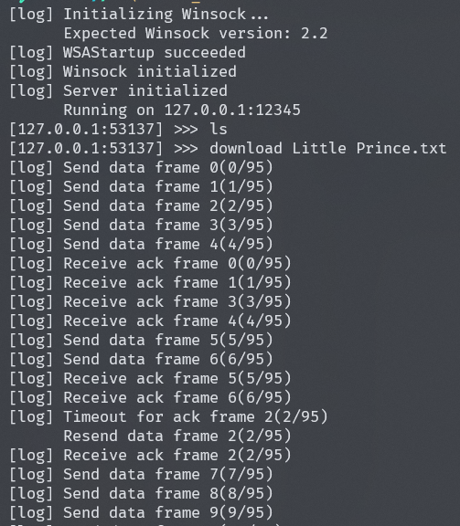

# rdt-cs-app

hit 计算机网络 lab2 及 lab3 的本人仓库

使用 cpp 编写，make 编译，已提供 makefile（不是很智能的），在重新 make 前需 clean。make 需在 pwsh（poweshell）中使用

main 入口有两个，一个在\~/src/client_test.cpp，一个在\~/src/server_test.cpp，修改类名与模板参数即可采用不同的可靠传输协议（需保证客户端与服务端二者一致）

具体类图见下：

客户端使用过程参考：

客户端传输过程：

服务端传输过程：

